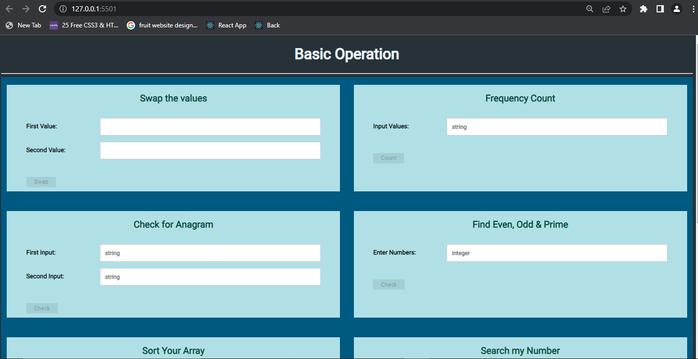
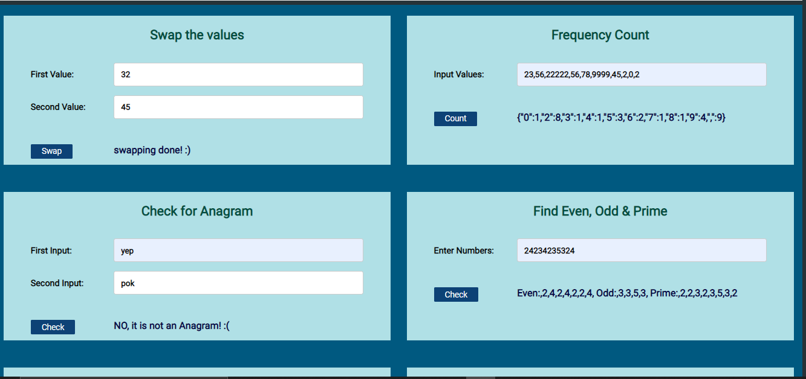
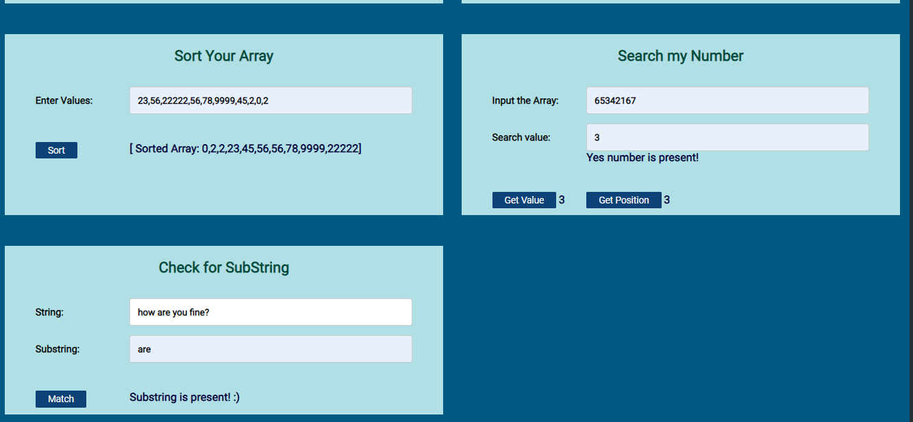
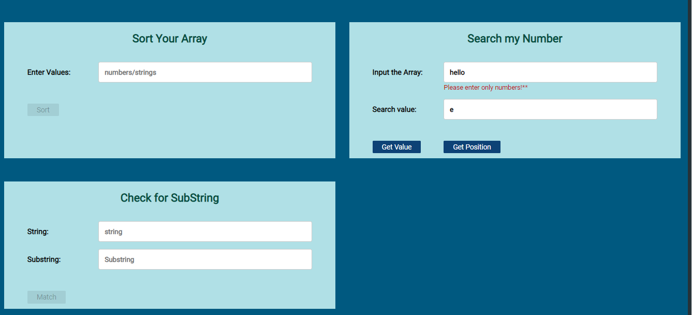
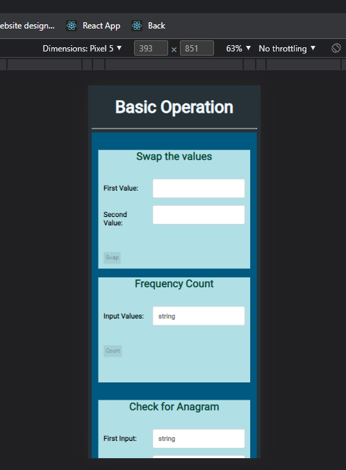

# Basic Operation Calculation Website 

## Poject Desrciption:

Basic Operation Calculation Website is a web Application  made of using pure Javascript's with HTML & CSS. In this application we can perform some basic calculations like:- Swapping Two Values, Frequency Count, Check for Anagram, Find Even,Odd, Prime, Sorting Array, Seacrh the Number, & Check for Substring. Having Seven Sections for it contains forms to get ouput with proper validation. This Website is fully responsive.

## Technology Used:

- JavaScript :- JavaScript is the Programming Language for the Web. JavaScript can update and change both HTML and CSS. JavaScript can calculate, manipulate and validate data.
- HTML: Hyper Text Markup Language is the standard markup language for creating Web pages, describes the structure of a Web page it consists of a series of elements that tell browser how to display the content.
- CSS: CSS is the language we use to style an HTML document & describes how HTML elements should be displayed.

## What I've Learnt :
- HTML how to write Html, learn different tags & syntax to  make forms, navbar, modelBox etc.
- How to apply CSS with class and Id. and their syntax.
- How to make fully responsive website using media Query
- writing clean and structure code.
- How ton disable buttons and enable when user input something.
- how to apply validation on from.
- button onClick events, DOM events, etc.
- how to debug and identifying error and also resolve it.
- proper CSS without using float, and not play with max to max margin & padding.

## Getting Started with Project

### `To start`

One Can use Live server. to run this project.
Live Server: It enables us to right-click an HTML document, and it runs a server for us and opens a browser window with the file in it. Any changes we make to the file causes the browser to reload and we can immediately see them. 

### Home - Page
Home Screen
.
- button is disabled initially and enable when user click on input field.

### Operation
Home Screen
.
- Basic operations performed like swapping, frequency Count, check Anagram, Find Even,odd,prime.

### Operation
Home Screen
.
- Basic operations performed like sorting, searching, finding subString.

### Validation
Home Screen
.
- Displaying Error message because operation is search for number but user enter string.

### Responsiveness
Home Screen
.
- Fully responsive